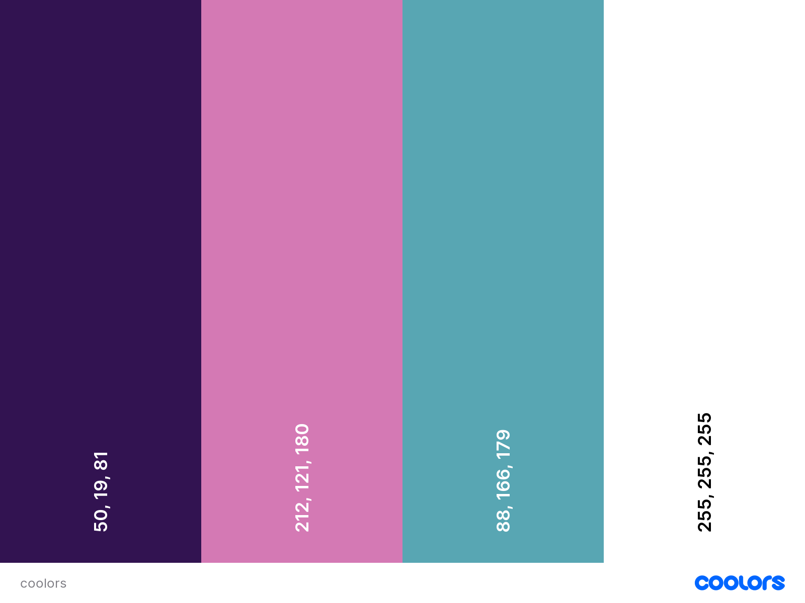
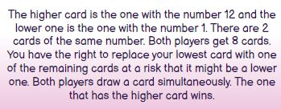
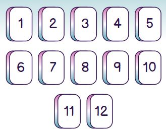
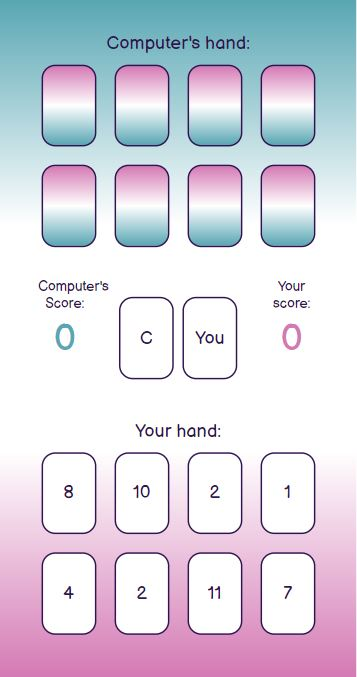
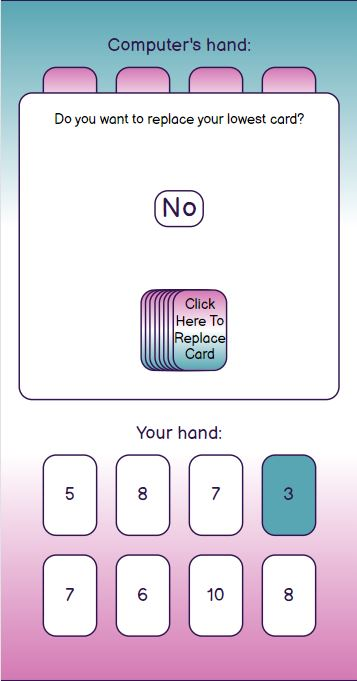
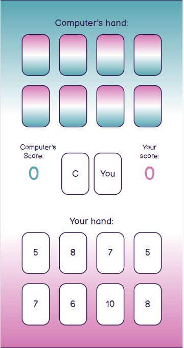
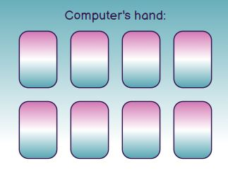
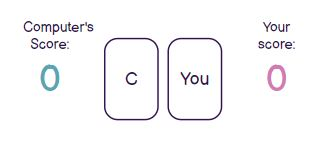
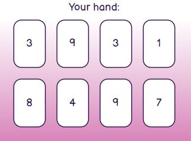
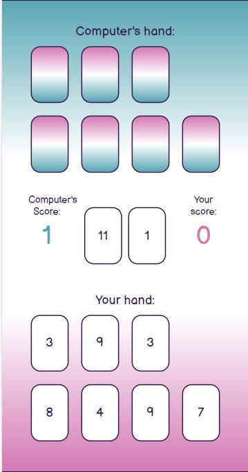

# [HIGHER WINS](https://efthymiakakoulidou.github.io/higher-wins)

Higher Wins is a card game where the player plays against the computer. The target audience can be children but is also fun to play for everyone!
It begins giving the instructions to player and introducing the deck.

The deck has 24 cards from 1 to 12, two of each numder.
The higher card is the one with the number 12 and the lower one is the one with the number 1.
Both players get 8 cards. 
You have the right to replace your lowest card with one of the remaining cards at a risk that it might be a lower one. Of course if you have a card with number '1' on it there is no risk, you have nothing to lose as there is not a lower card.
Both players draw a card simultaneously.
The one that has the higher card wins!

## UX

As the game is aiming a younger audience also, it was very important to have a clear structure and navigation, and fun colours.

### Colour Scheme

Fun bright colours where chosen and I did not want any association with gambling card-games so I avoided green, red, and black as well as suits.

- rgb(50, 19, 81) used for primary text.
- rgb(212, 121, 180) and rgb(88, 166, 179) used for secondary text and to indicate the places on the screen where the computer or the player play.

I used [coolors.co](https://coolors.co/e84610-009fe3-4a4a4f-445261-d63649-e6ecf0-000000) to generate my colour palette.

### Typography

I used Google Fonts and/or Font Awesome for my text and icons as well as https://icons8.com/icons/set/cards for my favicon.
I used one font throughout the project for consistency. I chose a font which reminded me of comics again to make it playful and to be liked by children.

- [Balsamiq](https://fonts.googleapis.com/css2?family=Balsamiq+Sans&display=swap) was used for the primary headers and titles.

- [Font Awesome](https://fontawesome.com) icons were used for the navigation and to refresh the page.

## Features

The game consists of a start page where the instructions are given, the deck is introduced and a button whith which the player can start the game. After the button is pushed the player gets a window with the question if he/she wants to replace his/hers lowest card with the first one of the pile of the remaining cards. After the player makes the choice he/she proceeds to play. 
The player can choose a card from his/hers hand which is placed in the middle of the screen at the place where the player's cards go. The computer does the same thing. The computer chooses randomly one card of its hand. 
The two cards stand next to each other and the comparison is made. This updates the score. The one with the higher card gets one point. In the case that the cards chosen have the same value no one gets a point.

### Existing Features

- **Instructions**

    - The instructions are essentials to play the game. One has to read them to understand what to do.

- **Deck**

    - The deck is presented both visually and in text. 
    Here the player gets a first glimpse of what the cards look like on both sides. This is important because the player's hand is open but the computer's cards are closed. 

- **Start button**

    - After going through all the information the player can push the start to start playing.

- **Navigation and refresh options**

    - We are now in the game page. In the header beside the title of the game there are the navigation link which leads to the start page and the restart button which refreshes the page. In this way the player has the opportunity to interrupt the game at any point and read the instructions again or start over.

- **The window where the player can make the choice of replacing the lowest card**

    - Before entering it and start playing the player has the choice of replacing his/hers lowest card. 
    The window giving this option is placed in such a way that the user knows that it is something working independently and if you click on it, it will disappear. It is placed also above the player's hand so that it is fully shown and the player knows that it is one of these cards that is going to be changed. It partially hides the computer's hand so that the player knows that you cannot affect those cards.
    At the same time the card with lowest value is indicated by a colour so that player knows that this card is going to be replaced. 
    After adding the indication to the lowest card I noticed that I myself was drawn to click on it, so I added the function of replacing the card also to the lowest card of the player's hand.

- **Clicking the 'No' button**

    - If the player choses not to replace the lowest card the game starts, the lowest card's colour disappears and it becomes like the rest of the cards.

- **Clicking the remaining cards pile or on the lowest card in the player's hand**

    - If the player choses to replace the lowest card it is replaced by a new card from the pile of the remaining cards, and the game starts.

 
 

- **Game layout**

    - The game starts. On the top of the screen there are the computer's closed cards with a title for making it even more clear.
    In the middle there is the game area. There are two spots in the middle where the player and the computer place their cards using also text to clarify it. Next to each spot there is the score area. The score for the player is next to player's played card and the score of the computer is next to computer's played card. This is also indicated with colours. The plaeyr's score has the colour of the background of the player's hand and the colour of the computer's score has the colour of the background of computer's hand.
    At the bottom of the page there are the player's open cards.

 
 
 

- **Game begins**

    - When the player chooses a card the card disappears from his/hers hand and is placed in the game area. The same with the computer's randomly chosen card. The score is being updated and the first round is over. This continues until the players run out of cards.

 

- **Game ends**

    - The game ends when there are no cards left and the message if you win or lose appears on the screen along with a button to start over. Also here the colour of the message corresponds to the player's colour and the computer's colour respectively.The message appears with a small delay so that you have the time to see the final score.

 

### Future Features

In the future the game coud be more complex. It could have more cards in the initial deck and the player could replace more of his/hers cards. Adding complexity could make it more interesting and target an older audience. Being able to replace more card could increase the excitement as you are called to take a risk there.
Also it could keep track of the wins or loses to have an overall idea of how it is going for you. 

## Tools & Technologies Used

🛑🛑🛑🛑🛑 START OF NOTES (to be deleted) 🛑🛑🛑🛑🛑

In this section, you should explain the various tools and technologies used to develop the project.
Make sure to put a link (where applicable) to the source, and explain what each was used for.
Some examples have been provided, but this is just a sample only, your project might've used others.
Feel free to delete any unused items below as necessary.

🛑🛑🛑🛑🛑 END OF NOTES (to be deleted) 🛑🛑🛑🛑🛑

- [HTML](https://en.wikipedia.org/wiki/HTML) used for the main site content.
- [CSS](https://en.wikipedia.org/wiki/CSS) used for the main site design and layout.
- [CSS Flexbox](https://www.w3schools.com/css/css3_flexbox.asp) used for an enhanced responsive layout.
- [JavaScript](https://www.javascript.com) used for user interaction on the site.
- [Git](https://git-scm.com) used for version control. (`git add`, `git commit`, `git push`)
- [GitHub](https://github.com) used for secure online code storage.
- [GitHub Pages](https://pages.github.com) used for hosting the deployed front-end site.
- [Gitpod](https://gitpod.io) used as a cloud-based IDE for development.

## Testing

For all testing, please refer to the [TESTING.md](TESTING.md) file.

## Deployment

The site was deployed to GitHub Pages. The steps to deploy are as follows:

- In the [GitHub repository](https://github.com/EfthymiaKakoulidou/higher-wins), navigate to the Settings tab 
- From the source section drop-down menu, select the **Main** Branch, then click "Save".
- The page will be automatically refreshed with a detailed ribbon display to indicate the successful deployment.

The live link can be found [here](https://efthymiakakoulidou.github.io/higher-wins)

### Local Deployment

This project can be cloned or forked in order to make a local copy on your own system.

#### Cloning

You can clone the repository by following these steps:

1. Go to the [GitHub repository](https://github.com/EfthymiaKakoulidou/higher-wins) 
2. Locate the Code button above the list of files and click it 
3. Select if you prefer to clone using HTTPS, SSH, or GitHub CLI and click the copy button to copy the URL to your clipboard
4. Open Git Bash or Terminal
5. Change the current working directory to the one where you want the cloned directory
6. In your IDE Terminal, type the following command to clone my repository:
	- `git clone https://github.com/EfthymiaKakoulidou/higher-wins.git`
7. Press Enter to create your local clone.

Alternatively, if using Gitpod, you can click below to create your own workspace using this repository.

Please note that in order to directly open the project in Gitpod, you need to have the browser extension installed.
A tutorial on how to do that can be found [here](https://www.gitpod.io/docs/configure/user-settings/browser-extension).

#### Forking

By forking the GitHub Repository, we make a copy of the original repository on our GitHub account to view and/or make changes without affecting the original owner's repository.
You can fork this repository by using the following steps:

1. Log in to GitHub and locate the [GitHub Repository](https://github.com/EfthymiaKakoulidou/higher-wins)
2. At the top of the Repository (not top of page) just above the "Settings" Button on the menu, locate the "Fork" Button.
3. Once clicked, you should now have a copy of the original repository in your own GitHub account!

### Local VS Deployment

There are no differences on the local and live version.

## Credits

### Content

🛑🛑🛑🛑🛑 START OF NOTES (to be deleted) 🛑🛑🛑🛑🛑

Use this space to provide attribution links to any borrowed code snippets, elements, or resources.
A few examples have been provided below to give you some ideas.

Ideally, you should provide an actual link to every resource used, not just a generic link to the main site!

🛑🛑🛑🛑🛑 END OF NOTES (to be deleted) 🛑🛑🛑🛑🛑

| Source | Location | Notes |
| --- | --- | --- |
| [Markdown Builder](https://tim.2bn.dev/markdown-builder) | README and TESTING | tool to help generate the Markdown files |
| [Chris Beams](https://chris.beams.io/posts/git-commit) | version control | "How to Write a Git Commit Message" |
| [W3Schools](https://www.w3schools.com/howto/howto_js_topnav_responsive.asp) | entire site | responsive HTML/CSS/JS navbar |
| [W3Schools](https://www.w3schools.com/howto/howto_css_modals.asp) | contact page | interactive pop-up (modal) |
| [W3Schools](https://www.w3schools.com/css/css3_variables.asp) | entire site | how to use CSS :root variables |
| [Flexbox Froggy](https://flexboxfroggy.com/) | entire site | modern responsive layouts |
| [Grid Garden](https://cssgridgarden.com) | entire site | modern responsive layouts |
| [StackOverflow](https://stackoverflow.com/a/2450976) | quiz page | Fisher-Yates/Knuth shuffle in JS |
| [YouTube](https://www.youtube.com/watch?v=YL1F4dCUlLc) | leaderboard | using `localStorage()` in JS for high scores |
| [YouTube](https://www.youtube.com/watch?v=u51Zjlnui4Y) | PP3 terminal | tutorial for adding color to the Python terminal |
| [strftime](https://strftime.org) | CRUD functionality | helpful tool to format date/time from string |
| [WhiteNoise](http://whitenoise.evans.io) | entire site | hosting static files on Heroku temporarily |

### Media

🛑🛑🛑🛑🛑 START OF NOTES (to be deleted) 🛑🛑🛑🛑🛑

Use this space to provide attribution links to any images, videos, or audio files borrowed from online.
A few examples have been provided below to give you some ideas.

If you're the owner (or a close acquaintance) of all media files, then make sure to specify this.
Let the assessors know that you have explicit rights to use the media files within your project.

Ideally, you should provide an actual link to every media file used, not just a generic link to the main site!
The list below is by no means exhaustive. Within the Code Institute Slack community, you can find more "free media" links
by sending yourself the following command: `!freemedia`.

🛑🛑🛑🛑🛑 END OF NOTES (to be deleted) 🛑🛑🛑🛑🛑

| Source | Location | Type | Notes |
| --- | --- | --- | --- |
| [Pexels](https://www.pexels.com) | entire site | image | favicon on all pages |
| [Lorem Picsum](https://picsum.photos) | home page | image | hero image background |
| [Unsplash](https://unsplash.com) | product page | image | sample of fake products |
| [Pixabay](https://pixabay.com) | gallery page | image | group of photos for gallery |
| [Wallhere](https://wallhere.com) | footer | image | background wallpaper image in the footer |
| [This Person Does Not Exist](https://thispersondoesnotexist.com) | testimonials | image | headshots of fake testimonial images |
| [Audio Micro](https://www.audiomicro.com/free-sound-effects) | game page | audio | free audio files to generate the game sounds |
| [Videvo](https://www.videvo.net/) | home page | video | background video on the hero section |
| [TinyPNG](https://tinypng.com) | entire site | image | tool for image compression |

### Acknowledgements

🛑🛑🛑🛑🛑 START OF NOTES (to be deleted) 🛑🛑🛑🛑🛑

Use this space to provide attribution to any supports that helped, encouraged, or supported you throughout the development stages of this project.
A few examples have been provided below to give you some ideas.

🛑🛑🛑🛑🛑 END OF NOTES (to be deleted) 🛑🛑🛑🛑🛑

- I would like to thank my Code Institute mentor, [Tim Nelson](https://github.com/TravelTimN) for their support throughout the development of this project.
- I would like to thank the [Code Institute](https://codeinstitute.net) tutor team for their assistance with troubleshooting and debugging some project issues.
- I would like to thank the [Code Institute Slack community](https://code-institute-room.slack.com) for the moral support; it kept me going during periods of self doubt and imposter syndrome.
- I would like to thank my partner (John/Jane), for believing in me, and allowing me to make this transition into software development.
- I would like to thank my employer, for supporting me in my career development change towards becoming a software developer.
